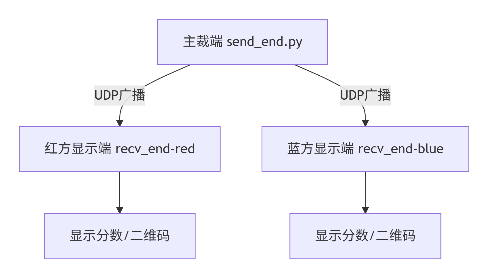

# 快速开始
* 对于本系统，必须安装下列所有库：
```
pip install -r requirements.txt
```
* 在refsys的recv_end.py中，对系统颜色进行修改，然后： 
```
pyinstaller --onefile --collect-all PyQt5 recv_end.py
```
* 之后可以将recv_end.exe和pyqt需要的本地dll文件一起拷贝入目标电脑，可以通过本地电脑运行send_end
## 修改网络配置
可以查询自己recv_end所在电脑的局域网IP，并在send_end.py程序头进行更改。
## 运行
1. 在主裁电脑运行 python send_end.py；
2. 在红方电脑运行 recv_end-red\recv_end.exe；
3. 在蓝方电脑运行 recv_end-blue\recv_end.exe
## 系统工作框图


# 项目内容
本项目目标是为HUST第三届“固胜MOZA”机甲大师校内赛开发一套供主裁使用的裁判系统，系统完成了自动计算得分与更新比赛进程，实现了实时计算得分并显示得分，对比赛的UI呈现起到了积极作用。
## 项目文件说明
refsys：主开发文件，生成recv_end不同色方需要的不同.exe
recv_end-red:红方分数显示、二维码显示，通过.exe直接运行
recv_end-blue:蓝方分数显示、二维码显示，通过.exe直接运行
## 项目文件结构
```
  README.md
├─recv_end-blue
│  │  0.png
│  │  1.png
│  │  2.png
│  │  3.png
│  │  4.png
│  │  5.png
│  │  6.png
│  │  7.png
│  │  8.png
│  │  9.png
│  │  python311.dll
│  │  Qt5Core_conda.dll
│  │  Qt5Gui_conda.dll
│  │  Qt5Widgets_conda.dll
│  │  recv_end.exe
│  │
│  └─platforms
├─recv_end-red
│  │  0.png
│  │  1.png
│  │  2.png
│  │  3.png
│  │  4.png
│  │  5.png
│  │  6.png
│  │  7.png
│  │  8.png
│  │  9.png
│  │  python311.dll
│  │  Qt5Core_conda.dll
│  │  Qt5Gui_conda.dll
│  │  Qt5Widgets_conda.dll
│  │  recv_end.exe
│  │
│  └─platforms
└─refsys
    │  0.png
    │  1.png
    │  2.png
    │  3.png
    │  4.png
    │  5.png
    │  6.png
    │  7.png
    │  8.png
    │  9.png
    │  fix_dlls.bat
    │  recv_end.py
    │  recv_end.spec
    │  send_end.py
    │  _oldV2_recv_end.py
    │  _old_recv_end.py
    │  _old_send_end.py
    │
    ├─build
    │  └─recv_end
    │      │  Analysis-00.toc
    │      │  base_library.zip
    │      │  EXE-00.toc
    │      │  PKG-00.toc
    │      │  PYZ-00.pyz
    │      │  PYZ-00.toc
    │      │  qt.conf
    │      │  recv_end.pkg
    │      │  warn-recv_end.txt
    │      │  xref-recv_end.html
    │      │
    │      └─localpycs
    │              pyimod01_archive.pyc
    │              pyimod02_importers.pyc
    │              pyimod03_ctypes.pyc
    │              pyimod04_pywin32.pyc
    │              struct.pyc
    │
    └─dist
        │  python311.dll
        │  Qt5Core_conda.dll
        │  Qt5Gui_conda.dll
        │  Qt5Widgets_conda.dll
        │  recv_end.exe
        │
        └─platforms
```
## 项目实现方式
本项目的send_end\recv_end-red\recv_end-blue 各使用了一台电脑，由主裁操纵send_end，借助局域网UDP通信向red、blue的电脑传递比赛剩余时间、赏金随机数、加分指令等信号，在接收端自主计算比赛得分并生成二维码随机数。
本项目的端口UI和配套进程借助PyQT开发，实现了进程调度需要。

## 项目展望
本项目从1-26日晚18点开始开发，1-28日中午12点调试完备，并用于比赛决赛。作为敝人第一个UI+局域网调度的项目，在计算资源选择上存在欠缺，比如下次可以将计算全部集成到send_end，只将recv_end用于显示，这样将极大减轻跨平台调试的开发时间成本。
同时，本系统对边裁并不友好，因为边裁才是对得分的最直接判定者，他们的消息只有直接对系统进行更新才能真正解放边裁计算/判断压力。之后可以将现在send_end功能进行拆分成send_end-side（ios\android,app形式），side再将更新集成到send_end-host，由host完成主要计算。
同时未来系统可以根据比赛状态、实际判罚、等待、特殊增益/加分等关键事件、并列比赛状态UI单独设计特殊CG , 进一步加强显示效果。